# design-bridge

[](https://github.com/gitsual/design-bridge/actions/workflows/ci.yml)
[](https://github.com/gitsual/design-bridge/actions/workflows/lint.yml)
[](./LICENSE)
[](https://nodejs.org)
[](./docs/registry.md)

A two-way bridge between Figma and a component library.

- **Figma → code**: pull Figma Variables and turn them into design tokens —
  CSS custom properties, SCSS variables, typed TypeScript.
- **Code → Figma**: describe your components in a registry, generate
  Storybook stories from it, import those into Figma with
  [story.to.design](https://story.to.design), then run the included Figma
  plugin to rebuild proper Component Sets from the flat import.

npm workspaces monorepo (`packages/*` only — the examples under `examples/`
are standalone consumers with their own `package.json`, so CI never installs
Angular or Storybook to run the test suite): `@design-bridge/tokens`, `@design-bridge/registry`,
`@design-bridge/generator`, `@design-bridge/figma-plugin`.

## What it looks like

The same three components, the same registry, the same fifteen tokens — in both
themes. Every image in this README is produced by the commands in it, with a
single exception — step 19, the Figma canvas — which is a labelled diagram and
says so in its own caption.

| Light | Dark |
| --- | --- |
|  |  |
|  |  |

Switching the theme rewrites one block of custom properties. Because semantic
tokens are emitted as `var(--palette-…)` rather than as literals, overriding the
palette is enough — no component knows a theme exists.

<picture>
  <source media="(prefers-color-scheme: dark)" srcset="docs/assets/storybook-dark.png">
  
</picture>

## The pipeline, step by step

This is the whole of design-bridge, in order, with a capture of every stage.
Nothing here is a mock-up except step 19, which says so in its own caption and
explains why.

Every terminal capture was produced by running the commands in this repository;
every Storybook capture is the `examples/vue-lib` workspace served by
`npm run storybook`; every plugin capture is `packages/figma-plugin/src/ui.html`
rendered with the real generated manifest loaded into it.

To reproduce the whole thing yourself:

```bash
npm ci
npm run demo          # steps 1-11, end to end, no network
npm run generate:vue  # steps 6-7 against the Vue example
npm run storybook     # steps 12-15
```

---

### Direction A — Figma → code

#### 1. What the Figma Variables API actually returns

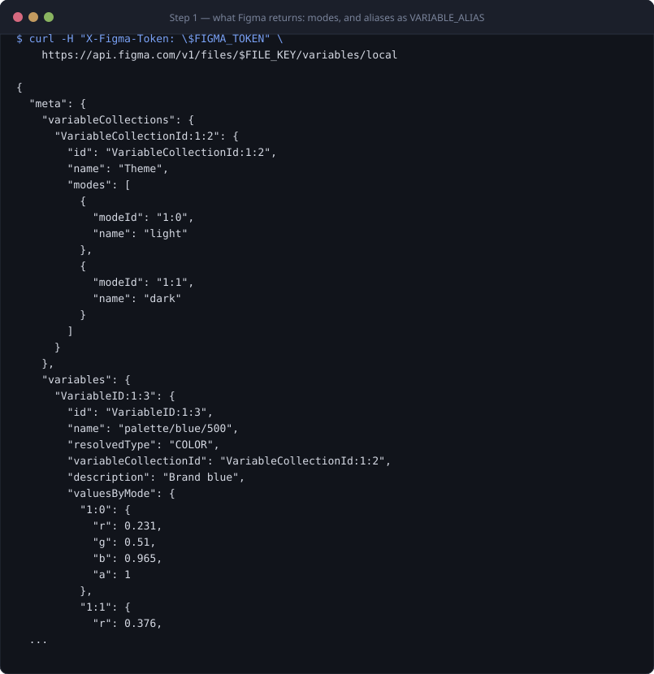

`GET /v1/files/:key/variables/local` gives back variables keyed by id, each
carrying one `valuesByMode` entry per mode, and colours as floating-point RGBA
in the 0–1 range. A variable pointing at another variable arrives as
`{ "type": "VARIABLE_ALIAS", "id": "VariableID:…" }` — an id, not a value.
Preserving that indirection instead of flattening it is what makes theming work
three steps later.

This endpoint requires a Figma **Enterprise** plan and a token scoped
`file_variables:read`. See [security.md](docs/security.md) for how the token is
handled.

#### 2. `pull` — one DTCG file per collection and mode

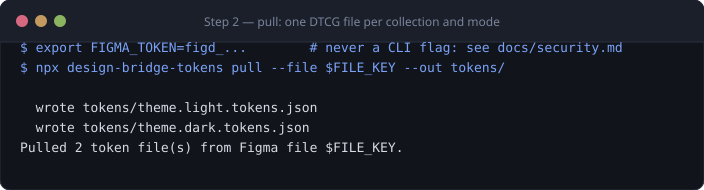

`pull` splits the response by collection **and** by mode, because a mode is not
a variant of a token — it is a whole parallel set of values. `palette/light` and
`palette/dark` become two files that can be built, diffed and reviewed
independently.

#### 3. The result: W3C DTCG, aliases intact

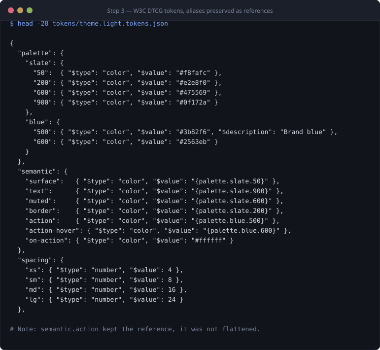

Slash-namespaced Figma names (`color/brand/primary`) become nested DTCG groups.
An alias becomes `"{palette.blue.500}"` — a reference in the
[W3C Design Tokens](https://www.w3.org/community/design-tokens/) format, which
any other DTCG tool can read. A dangling alias is a hard error, not a silent
`undefined`.

#### 4. `build` — one stylesheet, plus per-mode SCSS, TS and a flat map

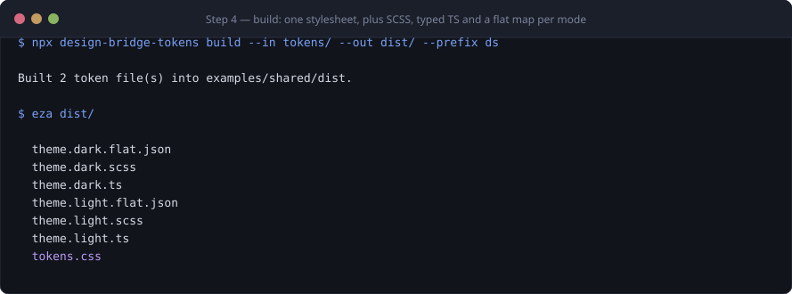

The default mode owns `:root`. Every other mode is emitted twice: once behind
`:root[data-theme="<mode>"]` for an explicit opt-in, and — for a mode named
`dark` — again inside `@media (prefers-color-scheme: dark)`, so the OS setting
wins unless the page pins a theme.

#### 5. Why the three targets differ


This is the one place the outputs deliberately disagree, and it is worth ten
seconds of your attention:

- **CSS keeps the alias** as `var(--ds-palette-blue-500)`. Overriding one
  palette token in a theme block then cascades to every semantic token that
  references it. That cascade IS the theming mechanism.
- **SCSS resolves the alias** to the literal value, because Sass compiles ahead
  of time and cannot follow a runtime `var()`.
- **TypeScript points at the CSS variable**, never at a literal, so a value read
  from TS and a value read from CSS can never drift apart.

---

### Direction B — code → Figma

#### 6. The registry: one declarative description

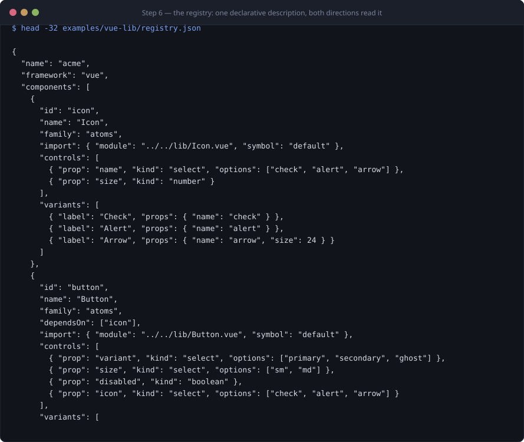

One JSON document describes the design system: components, their families,
their variants, their Storybook controls and — crucially — which components
nest which. Both the story generator and the Figma organizer read it, so they
cannot disagree. Full field reference: [registry.md](docs/registry.md).

#### 7. `generate` — stories, manifest and import plan

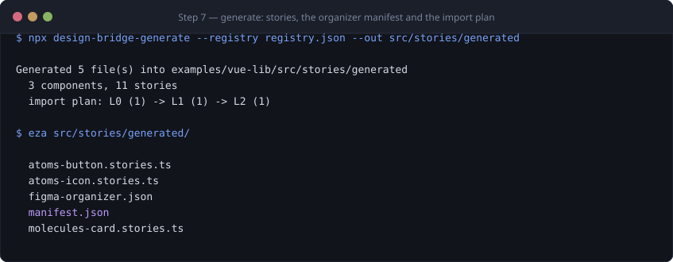

One command produces the Storybook stories, the organizer manifest the Figma
plugin consumes, and the import plan a human follows.

#### 8. A generated Vue story

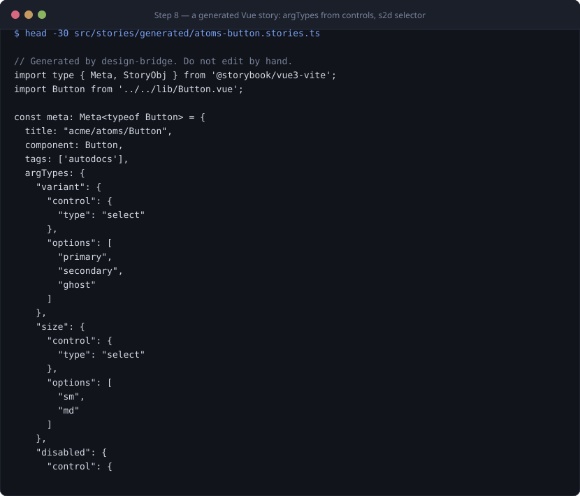

`controls` become `argTypes`. Variants become named exports. Variants carrying
`slot` content get a `render:` with a `data-figma-root` wrapper so
story.to.design imports the projected content too, instead of an empty shell.

#### 9. The same registry through the Angular adapter

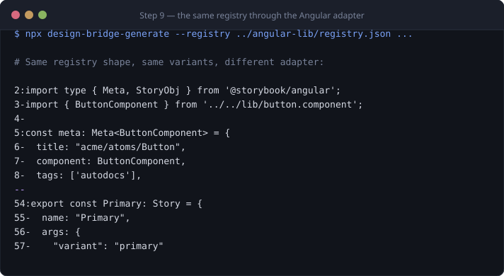

Same registry, `"framework": "angular"`, different adapter. Angular needs the
element `selector` to build a template for projected content — the schema
enforces that, rather than silently degrading to a props-only story. The
reasoning is in [registry.md](docs/registry.md#the-selector-field).

#### 10. The import plan — dependency layers

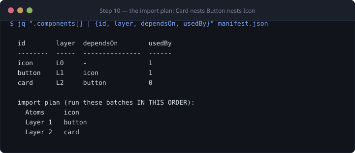

Card nests Button, which nests Icon. Import all three at once and Figma gives
you a Card containing a **detached copy** of Button — not an instance. So the
plan is topological: layer 0 first, componentise, then layer 1, then layer 2.
Each layer finds the one below it already a real component and links to it.

#### 11. The organizer manifest

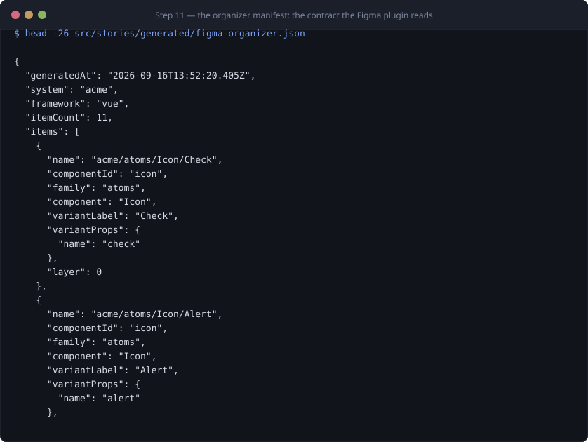

The contract between the code side and the plugin: for every frame that will
land in Figma, its family (→ which page), its component (→ which Component Set),
its variant properties (→ the Figma variant name) and its layer.

---

### Storybook

Served from `examples/vue-lib`, generated stories only.

#### 12. The generated tree

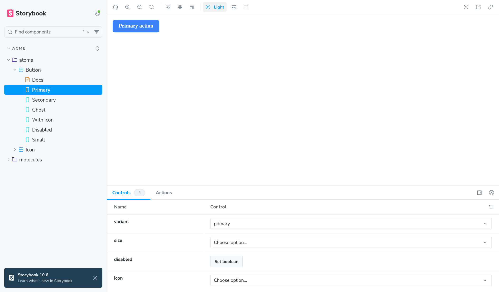

Families become folders. No file in this tree was written by hand.

#### 13. Controls, from the registry


Every row here came from a `controls` entry in the registry — `select` with its
options, `boolean`, `text`.

#### 14. Autodocs

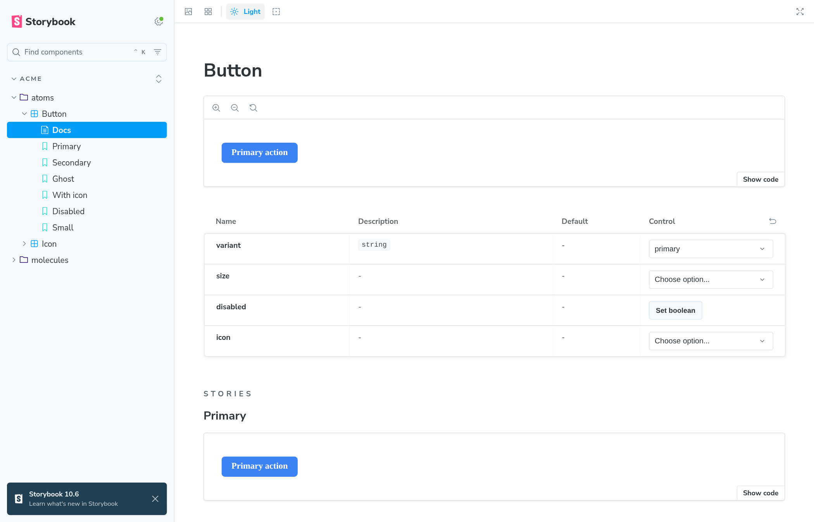

#### 15. Dark mode, driven by the tokens


The toolbar toggle sets `data-theme="dark"` on the root; the token stylesheet
from step 4 does the rest. Nothing in the component changes — the brand colour
moves from `#3b82f6` to `#60a5fa` purely through the cascade of step 5.

---

### The Figma plugin

`packages/figma-plugin/` rendered in a browser with the real generated manifest.

#### 16. Opened, nothing loaded

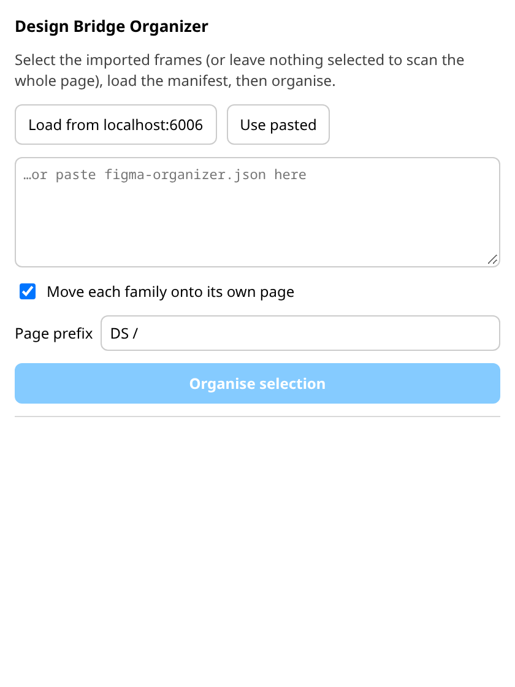

The run button starts disabled. There is nothing to organise until a manifest is
loaded.

#### 17. Manifest loaded

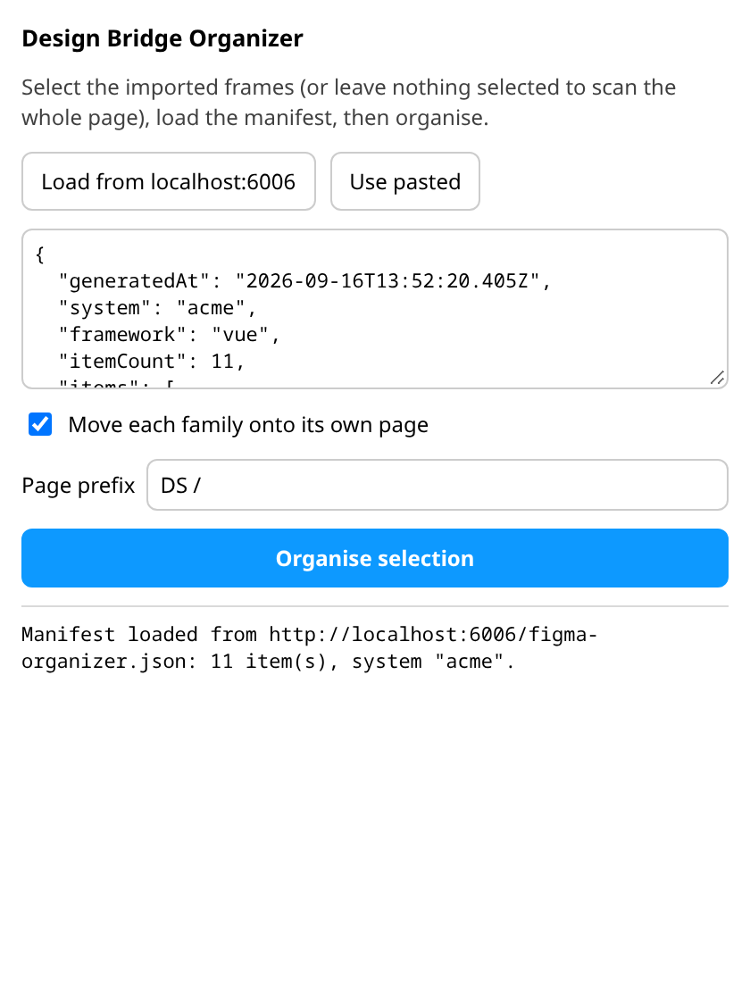

The plugin fetches `figma-organizer.json` from the running Storybook
(`localhost:6006`, with `127.0.0.1` as a fallback) and falls back to a paste box
when the dev server is not reachable — a Figma plugin iframe cannot always see
your localhost.

#### 18. After organising

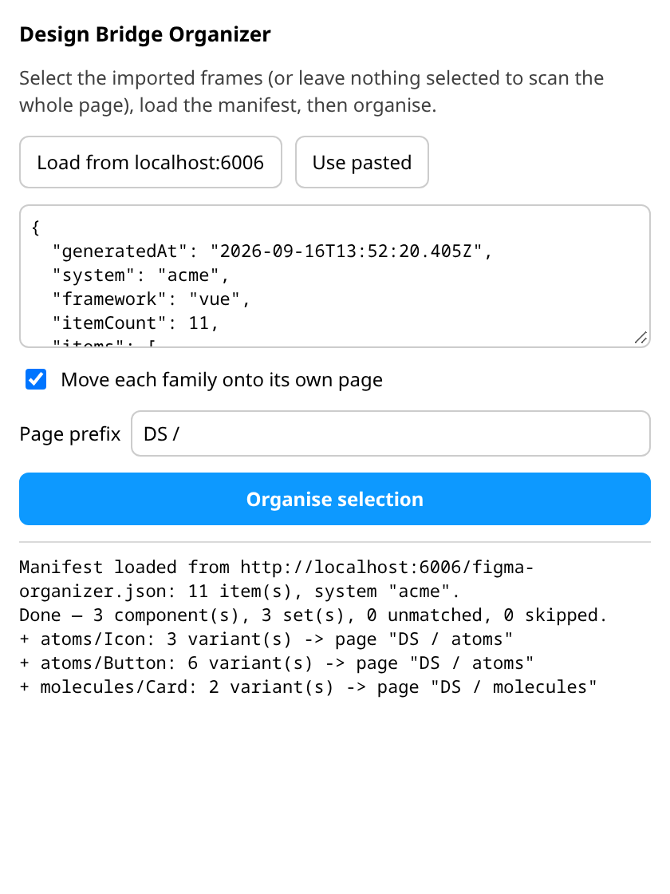

The log reports exactly what it built, per component, and how many frames it
could not match. Re-running is safe: an existing Component Set is skipped rather
than duplicated.

#### 19. What that looks like inside Figma

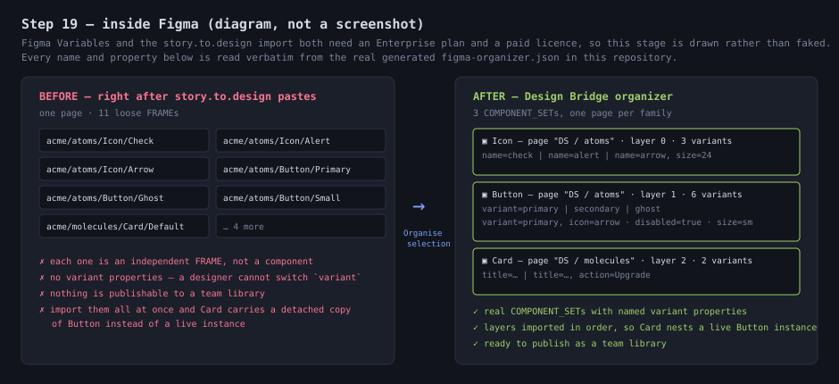

**This one is a diagram, not a screenshot, and that is deliberate.** The Figma
stage needs an Enterprise plan for Variables and a paid story.to.design licence
for the import. No such account was used to produce this repository, so rather
than stage a convincing fake, the stage is drawn — with every name and property
read verbatim from the real `figma-organizer.json` generated in step 7.

---

### Verification

Everything above is covered by tests, so the demo cannot quietly rot:

- `test/tokens-contract.test.mjs` — the stylesheet declares every `var(--ds-*)`
  any component references, Vue and Angular consume the same token set, and no
  component hard-codes a hex colour.
- `test/docs-assets.test.mjs` — every image referenced in the docs exists, and
  every file in `docs/assets` is referenced by something. An orphan capture
  fails the build.

```bash
npm test
```


## Architecture

```
 Direction A — Figma Variables become code
 ┌────────────┐   GET /variables/local    ┌──────────────────┐
 │   Figma     │ ─────────────────────────>│ design-bridge-    │
 │  Variables  │   (Enterprise plan only)  │ tokens (pull)      │
 └────────────┘                           └─────────┬─────────┘
                                                      │ DTCG token JSON
                                                      ▼
                                           ┌──────────────────┐
                                           │ design-bridge-    │
                                           │ tokens (build)     │
                                           └─────────┬─────────┘
                                                      │
                              ┌───────────────┬───────┴───────┬────────────────┐
                              ▼               ▼               ▼                ▼
                         tokens.css        *.scss          *.ts          *.flat.json


 Direction B — components become Figma Component Sets
 ┌──────────────┐  design-bridge-generate  ┌────────────────────┐
 │   registry    │ ─────────────────────────>│ Storybook stories   │
 │  (JSON)       │                          │ + figma-organizer.  │
 └──────────────┘                          │   json               │
                                            └──────────┬──────────┘
                                                        │ import (per dependency layer)
                                                        ▼
                                            ┌────────────────────┐
                                            │  story.to.design     │  (3rd-party Figma plugin)
                                            │  flat frame import   │
                                            └──────────┬──────────┘
                                                        │
                                                        ▼
                                            ┌────────────────────┐
                                            │  Design Bridge       │  (this repo's Figma plugin)
                                            │  Organizer            │
                                            │  → real Component Sets│
                                            │  → grouped by family  │
                                            └────────────────────┘
```

See [docs/pipeline.md](docs/pipeline.md) for the full walkthrough of both
directions.

## Direction A: Figma Variables → code

Figma Variables are read through `GET /v1/files/:key/variables/local` and
converted into [W3C DTCG](https://www.w3.org/community/design-tokens/) token
JSON, one file per collection/mode. Aliases between variables become DTCG
references (`"{color.brand.primary}"`), not resolved literals.

From there, tokens are built into platform artefacts. Aliases stay as
`var(--other-token)` in the emitted CSS, so overriding one palette token in a
theme block cascades to every semantic token that references it — that's how
theming works. The SCSS output resolves the same aliases to literal values
instead, because Sass compiles ahead of time and cannot follow a runtime
`var()`.

> **Figma Variables require an Enterprise plan.** The `variables/local` REST
> endpoint is gated to Enterprise Figma organizations, with an access token
> scoped to `file_variables:read`. On any other plan, `pull` will fail with an
> error from the Figma API.

## Direction B: components → Figma

A JSON [registry](docs/registry.md) declares each component's variants,
Storybook controls, and which other registry components it nests
(`dependsOn`). `design-bridge-generate` validates it and emits:

- One Storybook story file per component.
- `figma-organizer.json` — the manifest the Figma plugin reads to rebuild
  Component Sets from a flat `story.to.design` import.
- `manifest.json` — a human-readable summary, including the import order.

Import order matters: if `Card` nests `Button` and both are imported into
Figma in the same batch, Figma has no existing `Button` component to link to
yet, so the `Button` inside `Card` becomes a detached copy rather than a real
instance. The registry's `dependsOn` graph is layered
(`packages/registry/src/layers.mjs`) so atoms (layer 0) are always imported
before anything that nests them.

## Quickstart

```bash
npm install
```

To see both directions run end-to-end with no Figma account or network
access (a canned Figma Variables payload stands in for the API), run:

```bash
npm run demo
```

### Tokens

```bash
# Requires FIGMA_TOKEN in the environment (never pass it as a flag — see
# docs/security.md) and a Figma file key on an Enterprise plan.
FIGMA_TOKEN=... npx design-bridge-tokens pull --file <fileKey> --out tokens/

npx design-bridge-tokens build --in tokens/ --out dist/tokens --prefix ds
```

`build` writes `tokens.css` (all modes combined) plus one `.scss`, `.ts` and
`.flat.json` per `{collection}.{mode}` input file into `--out`.

### Components

```bash
npx design-bridge-generate --registry registry.json --out src/stories/generated --dry-run
npx design-bridge-generate --registry registry.json --out src/stories/generated
```

Then run Storybook, import it into Figma with
[story.to.design](https://story.to.design) one dependency layer at a time
(the printed import plan tells you the order), and run the **Design Bridge
Organizer** plugin — see
[packages/figma-plugin/README.md](packages/figma-plugin/README.md) to install
it via **Plugins → Development → Import plugin from manifest…** in the Figma
desktop app.

## Registry example

```json
{
  "name": "acme-ds",
  "framework": "vue",
  "components": [
    {
      "id": "button",
      "name": "Button",
      "family": "Actions",
      "import": { "module": "../../lib/Button.vue", "symbol": "default" },
      "variants": [
        { "label": "Primary", "props": { "variant": "primary", "size": "md" } }
      ],
      "controls": [
        { "prop": "variant", "kind": "select", "options": ["primary", "secondary", "ghost"] }
      ]
    },
    {
      "id": "card",
      "name": "Card",
      "family": "Layout",
      "dependsOn": ["button"],
      "import": { "module": "../../lib/Card.vue", "symbol": "default" },
      "variants": [
        { "label": "With action", "props": { "title": "Plan", "action": "Upgrade" } }
      ]
    }
  ]
}
```

Full field-by-field reference, including the `selector` field the Angular
adapter needs for slotted variants: [docs/registry.md](docs/registry.md).

## Prior art / alternatives

design-bridge is narrow on purpose — it only does the two things above. Some
honest comparisons:

- **[Style Dictionary](https://styledictionary.com/)** does the token side
  far more generally: many input formats, a large transform/format/filter
  pipeline, platform outputs beyond web. This project's DTCG-to-CSS/SCSS/TS
  build (`packages/tokens/src/build.mjs`) is deliberately about ~120 lines
  and dependency-free, covering exactly the DTCG → web-platform case. If you
  need Android/iOS outputs, custom transform pipelines, or non-Figma token
  sources, use Style Dictionary instead.
- **[Tokens Studio](https://tokens.studio/)** is a Figma plugin that manages
  tokens *as Figma Styles/Variables with its own token format*, inside Figma,
  with a two-way sync UI. design-bridge does not manage tokens inside Figma
  at all — it only reads Figma's native Variables API one-way (Figma → code)
  and has no UI for authoring tokens.
- **[Figma Code Connect](https://www.figma.com/code-connect-docs/)** links
  existing Figma components to existing code components so Figma's Dev Mode
  can show the real code snippet for a selected component. It does not
  generate Figma components from code, and it does not move tokens in either
  direction — it is a documentation/inspection layer on top of components
  that already exist on both sides.
- **[story.to.design](https://story.to.design)** is the actual Storybook →
  Figma importer this project depends on for Direction B; design-bridge does
  not reimplement it. What design-bridge adds on top is the registry (a
  single source of truth for variants/controls/dependencies shared with the
  rest of the pipeline), the dependency-layer import order, and the
  organizer plugin that turns story.to.design's flat frame import into
  grouped, named Component Sets.

**What this project does *not* do:** it has no live two-way sync (nothing
watches Figma or the codebase for changes and re-runs automatically), no UI
for editing tokens or the registry, and no support for design systems outside
Angular and Vue (`registry.framework` accepts only those two values). It
also does not manage anything beyond Figma Variables — component-level Figma
styles, effects, or text styles are out of scope.

## Contributing

See [CONTRIBUTING.md](CONTRIBUTING.md).

## License

[MIT](LICENSE) © 2026 Álvaro González Sanz
