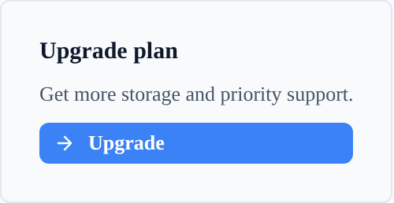
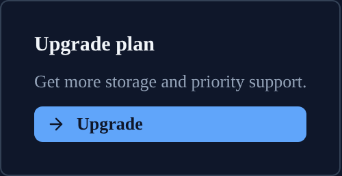
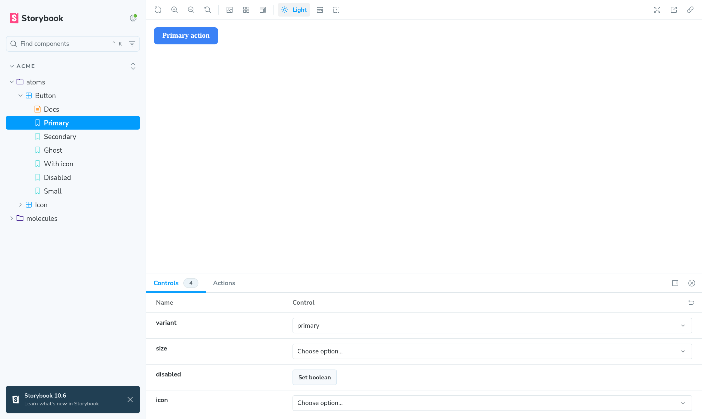
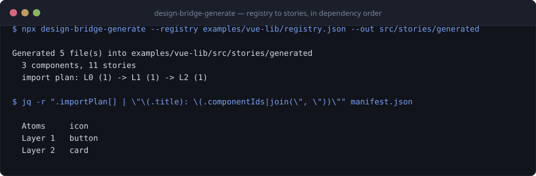
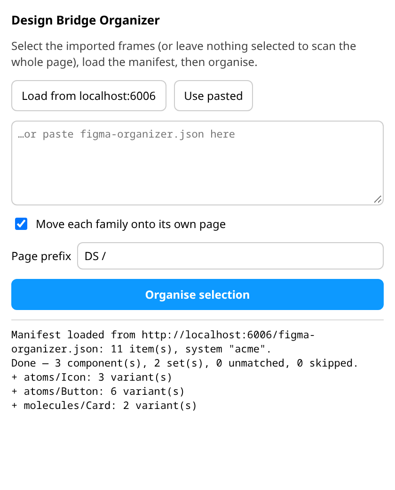
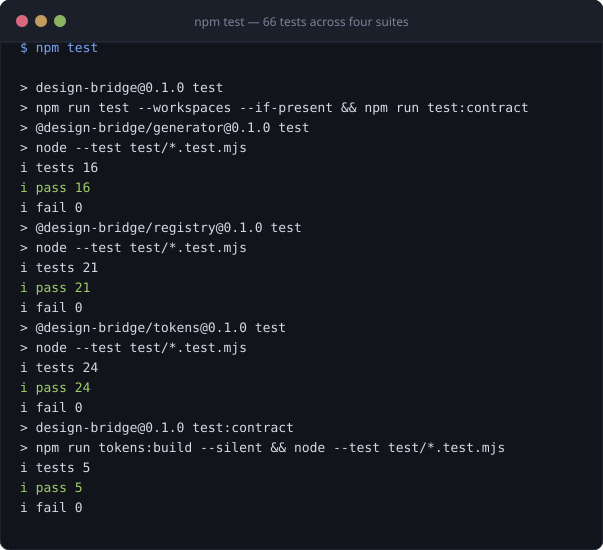

# design-bridge

[](https://github.com/gitsual/design-bridge/actions/workflows/ci.yml)
[](https://github.com/gitsual/design-bridge/actions/workflows/lint.yml)
[](./LICENSE)
[](https://nodejs.org)
[](./docs/registry.md)

A two-way bridge between Figma and a component library.

- **Figma → code**: pull Figma Variables and turn them into design tokens —
  CSS custom properties, SCSS variables, typed TypeScript.
- **Code → Figma**: describe your components in a registry, generate
  Storybook stories from it, import those into Figma with
  [story.to.design](https://story.to.design), then run the included Figma
  plugin to rebuild proper Component Sets from the flat import.

npm workspaces monorepo (`packages/*` only — the examples under `examples/`
are standalone consumers with their own `package.json`, so CI never installs
Angular or Storybook to run the test suite): `@design-bridge/tokens`, `@design-bridge/registry`,
`@design-bridge/generator`, `@design-bridge/figma-plugin`.

## What it looks like

The same three components, the same registry, the same fifteen tokens — in both
themes. Nothing below is a mockup: every image is produced by the commands in
this README.

| Light | Dark |
| --- | --- |
|  |  |
|  |  |

Switching the theme rewrites one block of custom properties. Because semantic
tokens are emitted as `var(--palette-…)` rather than as literals, overriding the
palette is enough — no component knows a theme exists.

<picture>
  <source media="(prefers-color-scheme: dark)" srcset="docs/assets/storybook-dark.png">
  
</picture>

### The pipeline, end to end

Pull Figma Variables and emit the platform artefacts:



Generate the stories, and with them the import plan — the order the components
must reach Figma in:



Then the bundled Figma plugin turns the flat `story.to.design` import back into
real Component Sets, grouped by family:

<picture>
  <source media="(prefers-color-scheme: dark)" srcset="docs/assets/figma-plugin-dark.png">
  
</picture>

And the whole thing is covered:



**[→ Every stage of the pipeline, captured in order (docs/demo.md)](docs/demo.md)**
— nineteen numbered steps from the raw Figma API response to the Component Sets
on the other side, each with the real output of the command that produced it.


## Architecture

```
 Direction A — Figma Variables become code
 ┌────────────┐   GET /variables/local    ┌──────────────────┐
 │   Figma     │ ─────────────────────────>│ design-bridge-    │
 │  Variables  │   (Enterprise plan only)  │ tokens (pull)      │
 └────────────┘                           └─────────┬─────────┘
                                                      │ DTCG token JSON
                                                      ▼
                                           ┌──────────────────┐
                                           │ design-bridge-    │
                                           │ tokens (build)     │
                                           └─────────┬─────────┘
                                                      │
                              ┌───────────────┬───────┴───────┬────────────────┐
                              ▼               ▼               ▼                ▼
                         tokens.css        *.scss          *.ts          *.flat.json


 Direction B — components become Figma Component Sets
 ┌──────────────┐  design-bridge-generate  ┌────────────────────┐
 │   registry    │ ─────────────────────────>│ Storybook stories   │
 │  (JSON)       │                          │ + figma-organizer.  │
 └──────────────┘                          │   json               │
                                            └──────────┬──────────┘
                                                        │ import (per dependency layer)
                                                        ▼
                                            ┌────────────────────┐
                                            │  story.to.design     │  (3rd-party Figma plugin)
                                            │  flat frame import   │
                                            └──────────┬──────────┘
                                                        │
                                                        ▼
                                            ┌────────────────────┐
                                            │  Design Bridge       │  (this repo's Figma plugin)
                                            │  Organizer            │
                                            │  → real Component Sets│
                                            │  → grouped by family  │
                                            └────────────────────┘
```

See [docs/pipeline.md](docs/pipeline.md) for the full walkthrough of both
directions.

## Direction A: Figma Variables → code

Figma Variables are read through `GET /v1/files/:key/variables/local` and
converted into [W3C DTCG](https://www.w3.org/community/design-tokens/) token
JSON, one file per collection/mode. Aliases between variables become DTCG
references (`"{color.brand.primary}"`), not resolved literals.

From there, tokens are built into platform artefacts. Aliases stay as
`var(--other-token)` in the emitted CSS, so overriding one palette token in a
theme block cascades to every semantic token that references it — that's how
theming works. The SCSS output resolves the same aliases to literal values
instead, because Sass compiles ahead of time and cannot follow a runtime
`var()`.

> **Figma Variables require an Enterprise plan.** The `variables/local` REST
> endpoint is gated to Enterprise Figma organizations, with an access token
> scoped to `file_variables:read`. On any other plan, `pull` will fail with an
> error from the Figma API.

## Direction B: components → Figma

A JSON [registry](docs/registry.md) declares each component's variants,
Storybook controls, and which other registry components it nests
(`dependsOn`). `design-bridge-generate` validates it and emits:

- One Storybook story file per component.
- `figma-organizer.json` — the manifest the Figma plugin reads to rebuild
  Component Sets from a flat `story.to.design` import.
- `manifest.json` — a human-readable summary, including the import order.

Import order matters: if `Card` nests `Button` and both are imported into
Figma in the same batch, Figma has no existing `Button` component to link to
yet, so the `Button` inside `Card` becomes a detached copy rather than a real
instance. The registry's `dependsOn` graph is layered
(`packages/registry/src/layers.mjs`) so atoms (layer 0) are always imported
before anything that nests them.

## Quickstart

```bash
npm install
```

To see both directions run end-to-end with no Figma account or network
access (a canned Figma Variables payload stands in for the API), run:

```bash
npm run demo
```

### Tokens

```bash
# Requires FIGMA_TOKEN in the environment (never pass it as a flag — see
# docs/security.md) and a Figma file key on an Enterprise plan.
FIGMA_TOKEN=... npx design-bridge-tokens pull --file <fileKey> --out tokens/

npx design-bridge-tokens build --in tokens/ --out dist/tokens --prefix ds
```

`build` writes `tokens.css` (all modes combined) plus one `.scss`, `.ts` and
`.flat.json` per `{collection}.{mode}` input file into `--out`.

### Components

```bash
npx design-bridge-generate --registry registry.json --out src/stories/generated --dry-run
npx design-bridge-generate --registry registry.json --out src/stories/generated
```

Then run Storybook, import it into Figma with
[story.to.design](https://story.to.design) one dependency layer at a time
(the printed import plan tells you the order), and run the **Design Bridge
Organizer** plugin — see
[packages/figma-plugin/README.md](packages/figma-plugin/README.md) to install
it via **Plugins → Development → Import plugin from manifest…** in the Figma
desktop app.

## Registry example

```json
{
  "name": "acme-ds",
  "framework": "vue",
  "components": [
    {
      "id": "button",
      "name": "Button",
      "family": "Actions",
      "import": { "module": "../../lib/Button.vue", "symbol": "default" },
      "variants": [
        { "label": "Primary", "props": { "variant": "primary", "size": "md" } }
      ],
      "controls": [
        { "prop": "variant", "kind": "select", "options": ["primary", "secondary", "ghost"] }
      ]
    },
    {
      "id": "card",
      "name": "Card",
      "family": "Layout",
      "dependsOn": ["button"],
      "import": { "module": "../../lib/Card.vue", "symbol": "default" },
      "variants": [
        { "label": "With action", "props": { "title": "Plan", "action": "Upgrade" } }
      ]
    }
  ]
}
```

Full field-by-field reference, including the `selector` field the Angular
adapter needs for slotted variants: [docs/registry.md](docs/registry.md).

## Prior art / alternatives

design-bridge is narrow on purpose — it only does the two things above. Some
honest comparisons:

- **[Style Dictionary](https://styledictionary.com/)** does the token side
  far more generally: many input formats, a large transform/format/filter
  pipeline, platform outputs beyond web. This project's DTCG-to-CSS/SCSS/TS
  build (`packages/tokens/src/build.mjs`) is deliberately about ~120 lines
  and dependency-free, covering exactly the DTCG → web-platform case. If you
  need Android/iOS outputs, custom transform pipelines, or non-Figma token
  sources, use Style Dictionary instead.
- **[Tokens Studio](https://tokens.studio/)** is a Figma plugin that manages
  tokens *as Figma Styles/Variables with its own token format*, inside Figma,
  with a two-way sync UI. design-bridge does not manage tokens inside Figma
  at all — it only reads Figma's native Variables API one-way (Figma → code)
  and has no UI for authoring tokens.
- **[Figma Code Connect](https://www.figma.com/code-connect-docs/)** links
  existing Figma components to existing code components so Figma's Dev Mode
  can show the real code snippet for a selected component. It does not
  generate Figma components from code, and it does not move tokens in either
  direction — it is a documentation/inspection layer on top of components
  that already exist on both sides.
- **[story.to.design](https://story.to.design)** is the actual Storybook →
  Figma importer this project depends on for Direction B; design-bridge does
  not reimplement it. What design-bridge adds on top is the registry (a
  single source of truth for variants/controls/dependencies shared with the
  rest of the pipeline), the dependency-layer import order, and the
  organizer plugin that turns story.to.design's flat frame import into
  grouped, named Component Sets.

**What this project does *not* do:** it has no live two-way sync (nothing
watches Figma or the codebase for changes and re-runs automatically), no UI
for editing tokens or the registry, and no support for design systems outside
Angular and Vue (`registry.framework` accepts only those two values). It
also does not manage anything beyond Figma Variables — component-level Figma
styles, effects, or text styles are out of scope.

## Contributing

See [CONTRIBUTING.md](CONTRIBUTING.md).

## License

[MIT](LICENSE) © 2026 Álvaro González Sanz
